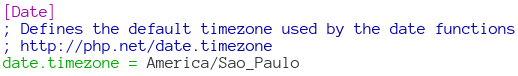

= PHP - Working Dates and Time
:toc:
:toc-placement: preamble

A short and quick examples to get started working with date and time in PHP.

== Intro

This is the first stop on this matter:
http://php.net/manual/en/book.datetime.php

To work with dates and time in PHP in an Object Oriented fashion, we need to
master at least three classes to start with: DateTime, DateInterval, and
DateTimeZone.

== Setting the timezone

To deal with date and time stuff, it is necessary to play with timezone
settings as well since the date and time will be obviously different in
different timezones, even within the same country.

The default and basic way is by setting the date.timezone entry in php.ini.
Either modify, uncomment, or create it.

As you see, it must be set in the [Date] section of the php.ini config file.

It is also possible (and more flexible) to set the timezone at run time.

[source, php]
----
echo 'Current timezone: ' .  date_default_timezone_get() . PHP_EOL;

date_default_timezone_set( 'Europe/Berlin' );
echo 'Europe/Berlin: ',  date( 'd/m/Y, h:i:s', time() ) . PHP_EOL;

date_default_timezone_set( 'America/Sao_Paulo' );
echo 'America/Sao_Paulo: ', date( 'd/m/Y, h:i:s', time() ) . PHP_EOL;
----

== PHP Datetime and DateInterval Classes

DateTime accepts two parameters: a string specifying the date/time, and a
DateTimeZone object. Both are optional and default to 'now' and NULL
respectively. DateTimeZone itself requires a string specifying the timezone.

Example 1, creating and displaying the current date and time.

[source, php]
----
try {
    $dtas = new DateTime( 'now', new DateTimeZone( 'America/Sao_Paulo' ) );
    echo $dtas->format( 'd/m/Y h:i:s' ) . PHP_EOL;
}
catch ( Exception $err ) {
    echo $err->getMessage() . PHP_EOL;
}
----

'now' can be substituted by any valid

[date and time string](http://php.net/manual/en/datetime.formats.php),
like '+ 2 days', '2010-03-27' (yyyy-mm-dd) or '2010-03-27 t13:15:59'. t is
optional. Note also that even if one specifies '13' for hour, the format “h” is
for 12-hour clock, so, '13' will be output as '1' (p.m), and “H” will really
output '13'.

Note the try/catch blocks. They are highly advisable, but to keep things
concise, will not handle exceptions in the next examples.

Example 2, a simpler way to get current date and time:

[source, php]
----
$dt = new DateTime();
echo $dt->format( 'd/m/Y H:i:s' ) . PHP_EOL;
----

By not specifying DateTime's constructor optional arguments, we default to
'now' for the date and time, and the timezone is the one specified in php.ini
or date_default_time_zone_set( 'foo/bar' ) runtime configuration.

== Adding and Subtracting

DateTime provides methods like add, sub and diff. They take a DateInterval
object as argument. DateInterval itself takes string in a very specific format.
For example `'P1D30M'` means “one day and 30 minutes”. `'P2Y3M4DT6H9M59S'` means
“two years, three months, four days, 6 hours 9 minutes and 59 seconds. Just
start from the larges scale to the smallest.

Important: Use P before year, months, weeks and days. Use T before hours,
minutes and seconds.

Example. Add 1 day and 2 hours to the current date/time.

[source, php]
----
$dt = new DateTime( 'now', new DateTimeZone( 'America/Sao_Paulo' ) );
$dt->add( new DateInterval( 'P1DT2H' ) );
echo $dt->format( 'd/m/Y h:i:s' );
----

Subtract 1 year, 3 months, 5 days, 1 hour, 20 minutes and 35 seconds.

[source, php]
----
$dt = new DateTime( 'now', new DateTimeZone( 'America/Sao_Paulo' ) );
$dt->sub( new DateInterval( 'P1Y3M5DT1H20M35S' ) );
echo $dt->format( $fmt ) . PHP_EOL;
----

BEWARE:

This takes leap years and daylight saving time into consideration:

[source, php]
----
$date = strtotime( '+ 7 days', time() );
----

But this does NOT:

[source, php]
----
$date = time() + 7 * 24 * 60 * 60;
----

NOTE: This is always a work in progress. Even if this can at some point be
considered an okay intro to the subject of date and time in PHP, corrections
and improvements will always be welcome.

//// vim:set filetype=asciidoc:
